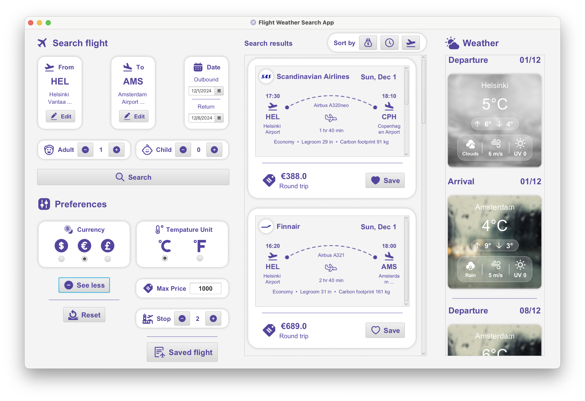
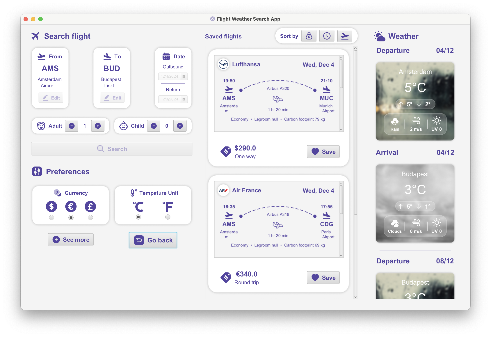

# User manual

You can use this application to search information about commercial flights based on a given staring point and destination.

The search result will contain multiple valuable information, including date and time, airline, type of aircraft, price and possible layover. Moreover, you also can see the weather forecast based on local arrival and departure times.

To further customize user's experience, you can also save favorite flights and conveniently access them later. You are also able to choose a preferred currency and filter results based on number of layovers, number of passengers or the maximum price of the trip.

If there are too many flights available, you can also be sorted based on flight duration, price or departure time for both searched and saved flights.

# Application Previews

#  Installation & Run instruction

There are two main ways to run the application:
1. The first method: Run through command line, which is considered quick and easy.
- Firstly, you need to clone this repository into your local device.
- Navigate to the application’s JAR file, which is located in the ‘Release’ folder of the group’s root directory.
- Next, you can run it by using the command line ‘java -jar "FlightWeatherApp.jar"’ at the ‘Release’ folder’s directory.

Notice: This command line is supposed to work in Windows operating system; however, we have not fully tested the software on MacOS counterpart yet.

2. The second method: Run through Netbeans IDE, which is a more reliable way.
- Firstly, you need to clone this repository into your local device and configure it as Maven project.
- Make sure you have installed Netbeans IDE and supported modules such as JavaFX with correct version stated at the end of this README file.
- Open the project in Netbeans and select the "Run" button to start the application.

Notice: This method is proved to work on both MacOS and Windows operating systems.

# Java Version

This project is built and tested with versions of Java as shown below:
- Maven's version: 11
- JavaFX's version: 21
- Java's version: 23
