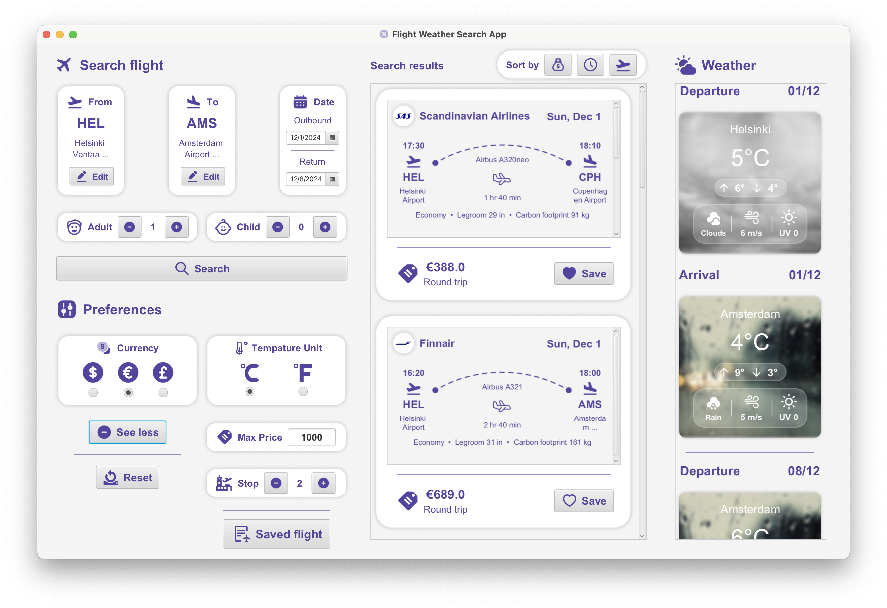
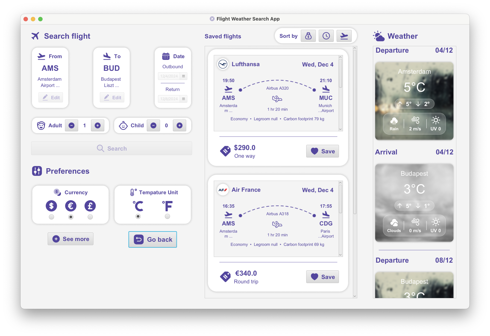

# Flight Weather App

A JavaFX desktop app for searching commercial flights and viewing weather forecasts for the departure and arrival airports. Flight search and airport/weather details are retrieved from online services, so an internet connection and available API service are required.

## Features

- Search one-way and round-trip flights by departure and arrival airport.
- Choose travel dates and adult/child passenger counts.
- Filter results by number of stops and maximum price.
- Sort current results and saved flights by price, duration, or departure time.
- View flight details and weather forecasts for the journey.
- Save favorite flights and retain recent searches and preferences.
- Choose a supported currency (USD, EUR, or GBP) and weather unit (metric or imperial).

## Screenshots





## Repository layout

```text
.
├── FlightWeatherApp/
│   ├── pom.xml                 # Maven build, dependencies, and JavaFX run configuration
│   ├── settings.json           # Sample app data for running from this directory
│   └── src/
│       ├── main/java/          # JavaFX app, controllers, API clients, and persistence
│       ├── main/resources/     # FXML screens and image assets
│       └── test/java/          # Unit tests
└── Release/
    ├── FlightWeatherApp.jar    # Packaged application
    ├── Design Documentation.pdf
    ├── settings.json           # Sample app data for running from this directory
    └── Thumbnails/             # README screenshots
```

The app uses SerpApi for Google Flights search, API Ninjas for airport data, and OpenWeatherMap for weather. Saved favorites, recent searches, and preferences are read from and written to `settings.json` in the app's current working directory.

## Requirements

- JDK 17 or newer (JavaFX 21 requires Java 17 or newer).
- Maven 3.x for building, testing, or running from source.

The Maven compiler is configured to target Java 11 bytecode. That target does not lower the JavaFX runtime requirement: use JDK 17 or newer to run the app.

## Run the application

### Run the bundled JAR

```sh
cd Release
java -jar FlightWeatherApp.jar
```

### Run from source with Maven

```sh
cd FlightWeatherApp
mvn javafx:run
```

To run the tests:

```sh
cd FlightWeatherApp
mvn test
```

## Design documentation

See [Design Documentation.pdf](Release/Design%20Documentation.pdf) for the detailed software design.
